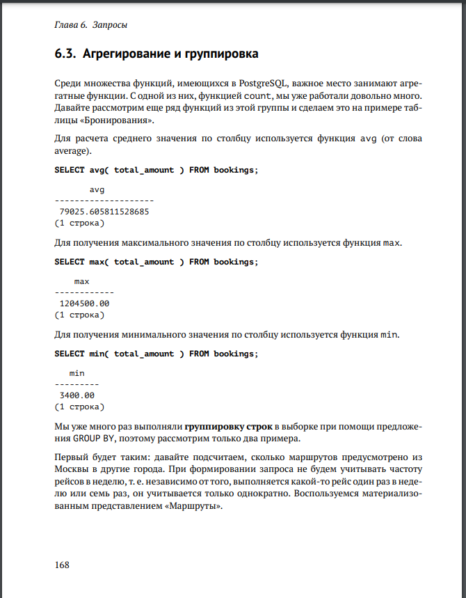
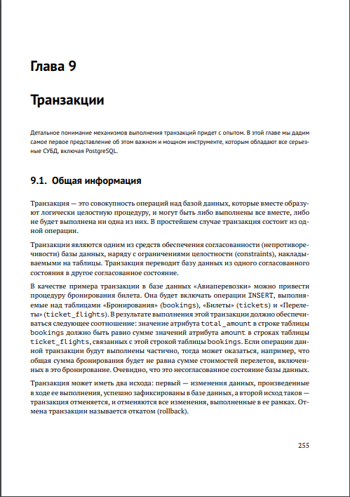
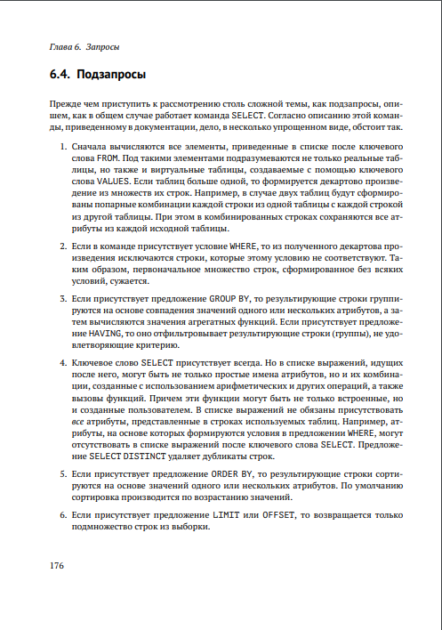
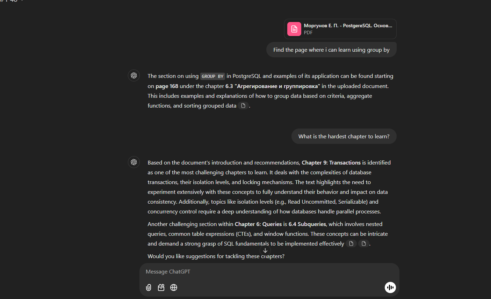
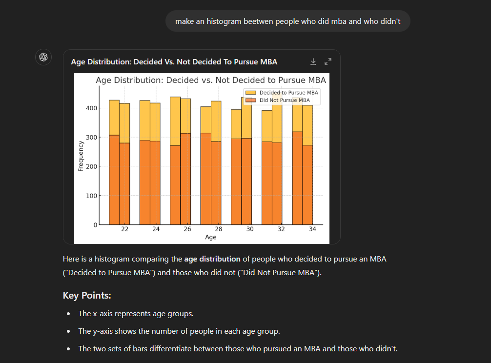

# Data Interaction with ChatGPT

This project demonstrates interacting with a PDF document and a CSV dataset using ChatGPT.

## 1. Chat Over PDF

- **Data Source**: [PostgreSQL. Основы языка SQL](https://edu.postgrespro.ru/sql_primer.pdf)
- **Used Prompts**: 
  - "Find the page where i can learn using group by" 
    
  - "What is the hardest chapter to learn?"
    
    
- **Screenshot**:  
  
- **Chat Link**: [click here to open chat](https://chatgpt.com/share/67968f7e-c928-8006-9c9c-977f6e98517f)

## 2. CSV Histogram

- **Data Source**: [MBA Decision After Bachelor's](https://www.kaggle.com/datasets/ashaychoudhary/dataset-mba-decision-after-bachelors)
- **Used Prompts**: 
  - make an histogram beetwen people who did mba and who didn't
- **Screenshot**:  
  

## How to Reproduce

1. Upload the data files (PDF and CSV) to ChatGPT.
2. Interact with the PDF by asking relevant questions.
3. Ask ChatGPT to build a histogram for a specific column from the CSV dataset.

## License

This project is open source and available under the MIT License.
