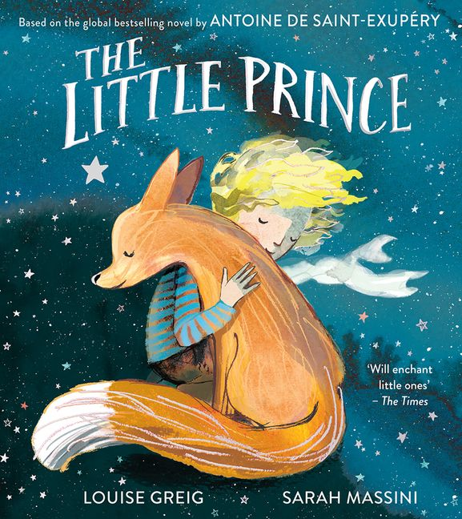
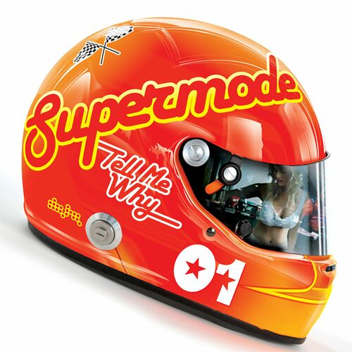
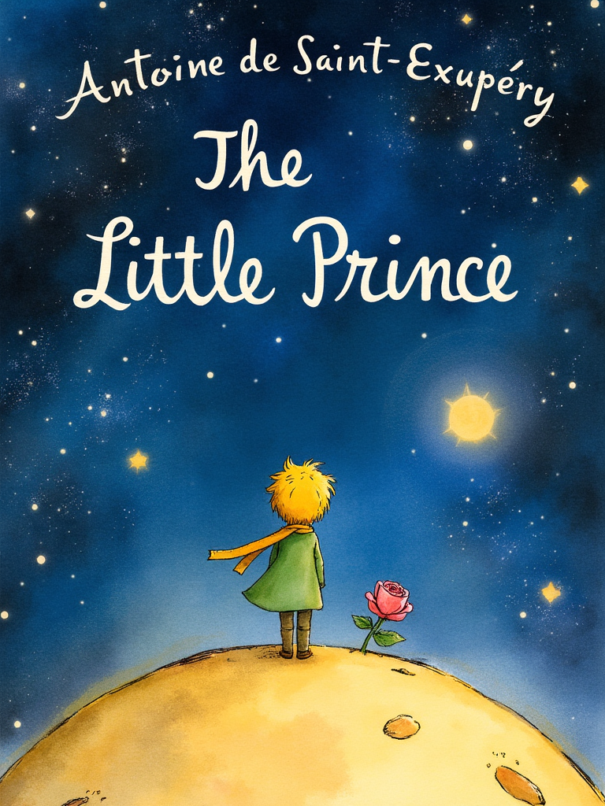
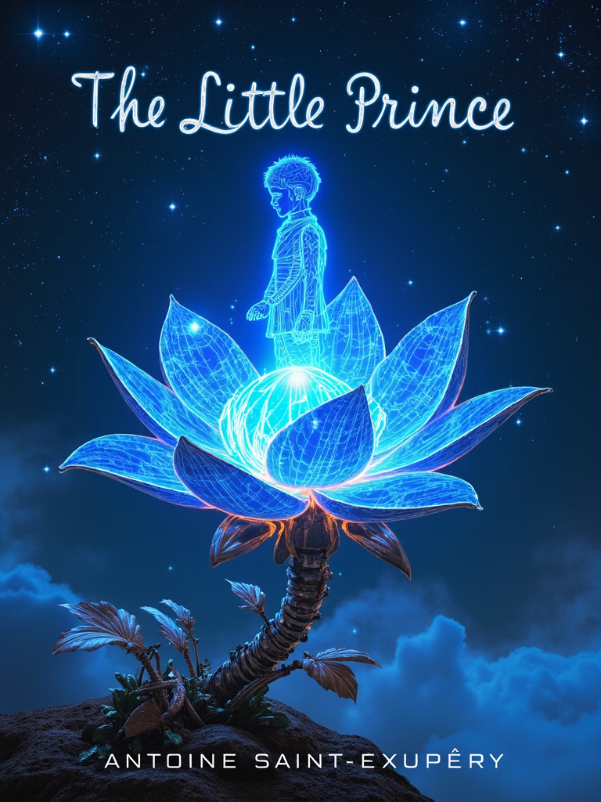
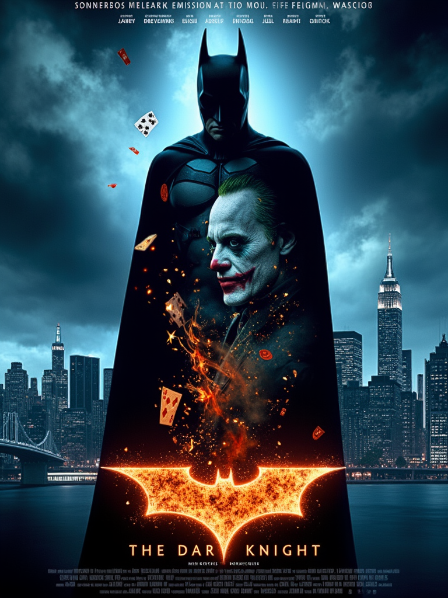
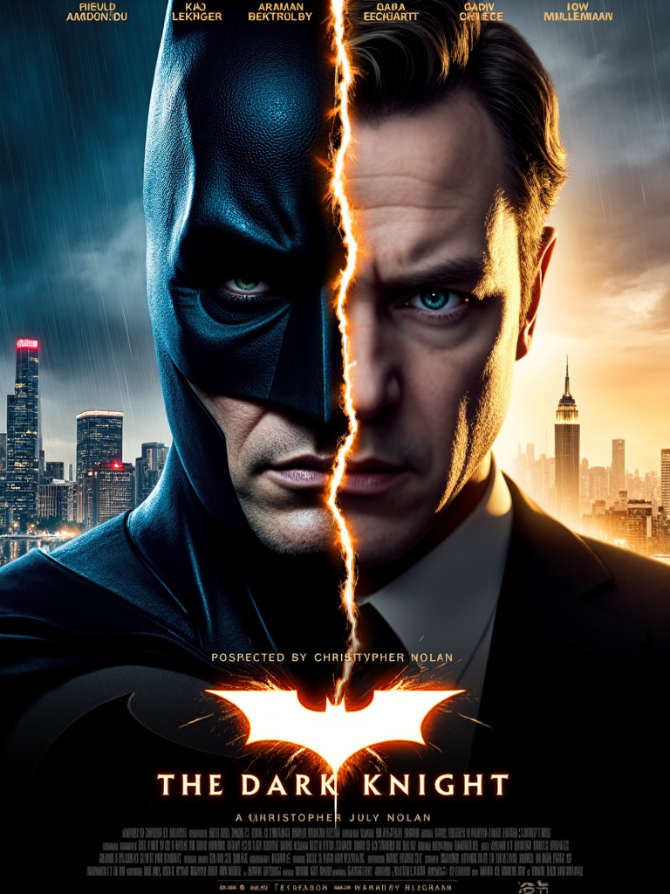
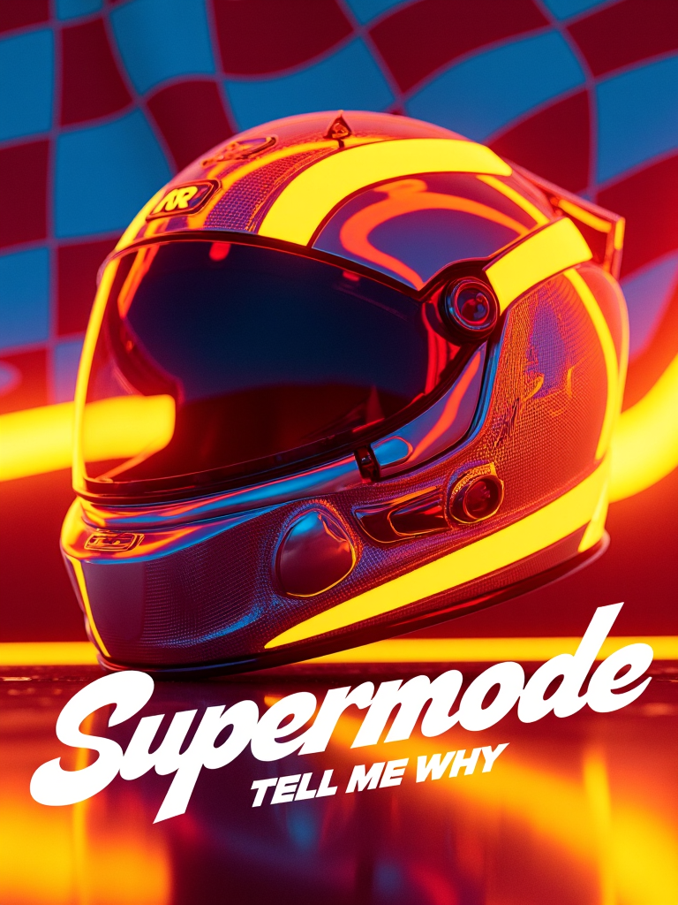
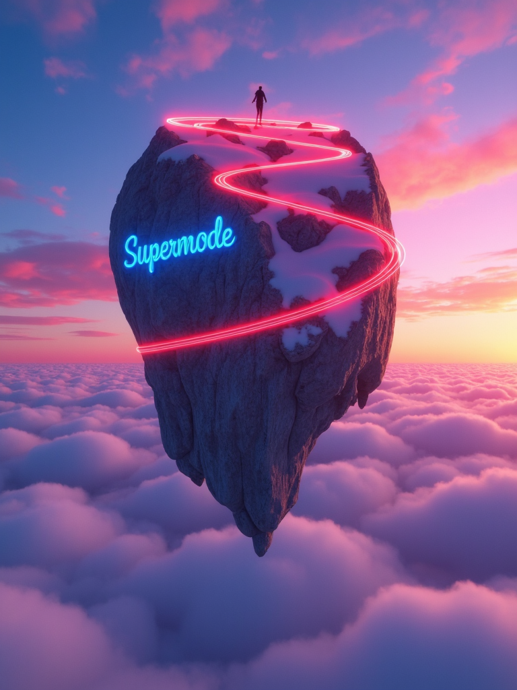
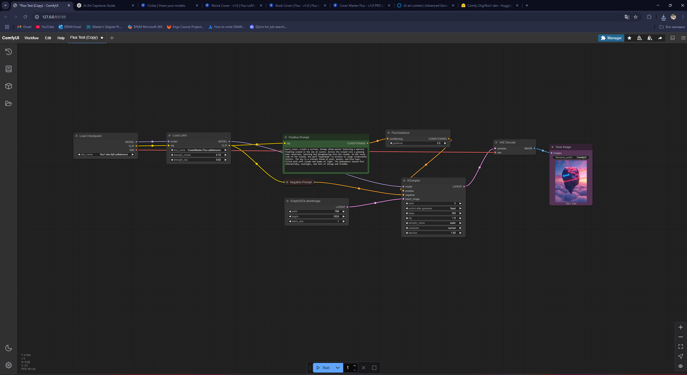

# Art Capstone Final Report

## Original Works

### 1. Book: The Little Prince

### 2. Movie: The Dark Knight

### 3. Music Album: Supermode “Tell Me Why”

---

## AI-Generated Variations

### 1. Book Cover Variations

### 2. Movie Poster Variations

### 3. Music Album Cover Variations

---

## Workflow

1. **Image generation model used**  
   - **Model:** flux1-dev by Comfy-Org  
     - **Checkpoint:** `flux1-dev-fp8.safetensors`  
     - **Link:** https://huggingface.co/Comfy-Org/flux1-dev

2. **LoRAs / Adapters / Extensions**  
   - **Book variant LoRA:** [book-cover-or-flux](https://civitai.com/models/793367/book-cover-or-flux)  
   - **Movie variant LoRA:** [movie-cover](https://civitai.com/models/1388823/movie-cover)  
   - **Album variant LoRA:** [cover-master-flux](https://civitai.com/models/1073657/cover-master-flux)

3. **Technical generation details**  
   - **Steps:** 50  
   - **CFG Scale:** 1  
   - **Sampler:** Euler A  
   - **Resolution:** 768×1024 (all)  
   - **Denoising strength:** 1  
   - **Precision:** FP16 with upcast cross-attention to float32  

4. **Pipeline configuration**  
   

5. **Prompts used**  
   - **Book:**  
     1. _book_cover, title "the little prince", written by "Antoine de Saint-Exupéry" A whimsical and dreamy book cover illustration for The Little Prince, featuring a small blonde-haired boy wearing a green coat and golden scarf, standing on a tiny asteroid-like planet surrounded by stars. The background is a deep, magical night sky filled with galaxies and constellations. A delicate rose blooms beside him. The style is soft watercolor, gentle lighting, emotional, imaginative, with a sense of wonder and innocence. clear, sharp, readable typography, centered title, elegant font, no distortions, minimalist font._  
     2. _book_cover, A surreal futuristic book cover for The Little Prince. A glowing blue hologram of a small boy with delicate features, wrapped in shimmering digital threads like a scarf, floats above a massive, biomechanical flower planet in deep space. The flower is made of intertwining metallic vines, cybernetic petals, and pulsating neon cores. Around them, the void sparkles with fractal constellations and fragmented space-time structures. The atmosphere is both melancholic and awe-inspiring, blending beauty, technology, and cosmic mystery. Intricate detailing, vibrant yet soft neon colors, cinematic composition, dreamlike, futuristic, ethereal. Include the book title 'The Little Prince' at the top and the author's name 'Antoine de Saint-Exupéry' bottom of the image, in elegant, futuristic typography, integrated naturally into the design, glowing softly with matching neon blue hues._  
   - **Movie:**  
     1. _movie_cover, A dark, cinematic movie poster for The Dark Knight, featuring a monumental silhouette of Batman standing tall against a stormy Gotham skyline bathed in neon blues and deep shadows. Inside Batman's silhouette, a ghostly chaotic image of the Joker emerges through swirling smoke, flickering flames, playing cards, and chaotic graffiti. Sparks and embers float through the air, creating a gritty, intense atmosphere. The poster includes elegant, bold typography: the title 'THE DARK KNIGHT' at the bottom center, a glowing release date 'JULY 18' directly below it, names of the main actors aligned above the title, and detailed production credits at the very bottom. High contrast lighting, double exposure effect, modern neo-noir visual style, epic composition, dramatic clouds, cinematic quality, emotionally intense and visually stunning._  
     2. _movie_cover, A powerful and emotional cinematic movie poster for The Dark Knight (2008), directed by Christopher Nolan. The poster features a close-up of a split face: The left half shows Batman wearing his iconic black mask, lit with cold blue light, standing against a dark, rainy Gotham skyline at night filled with neon lights and destruction.  The right half shows Bruce Wayne's real face, portrayed by actor Christian Bale, illuminated with soft warm light, standing against a daytime Gotham skyline with muted golden hues, evoking loneliness and reflection. His facial expression is serious, melancholic, filled with inner conflict.  A thin glowing crack separates the two halves, symbolizing the fragile boundary between heroism and villainy. The background on each side reflects the character's world: darkness and chaos for Batman, cold daytime and solitude for Bruce Wayne.  The iconic quote 'You either die a hero, or you live long enough to see yourself become the villain' is elegantly written across the middle or subtly integrated into the sky.  The title 'THE DARK KNIGHT' is boldly centered at the bottom, with a glowing release date 'JULY 18' underneath. Above the title are the names of the main actors — Christian Bale, Heath Ledger, Aaron Eckhart, Michael Caine, Maggie Gyllenhaal, Gary Oldman, Morgan Freeman — in stylish cinematic font. 'Directed by Christopher Nolan' is clearly credited above the detailed production credits and studio logos (Warner Bros., Legendary Pictures, DC Comics). The color palette contrasts deep blues, blacks, and grays on Batman's side with soft golds, muted browns, and light grays on Bruce Wayne's side. Ultra-high detail, dramatic neo-noir visual style, cinematic lighting, emotional and symbolic composition._  
   - **Album:**  
     1. _music_cover, Create a vibrant and energetic album poster inspired by 80s and early 2000s electronic music. Use a bold, colorful style with neon orange, red, and yellow tones. Incorporate dynamic racing or speed elements like checkered flags, racing numbers, and metallic textures. The album title is "Supermode" and the subtitle "Tell Me Why" should be styled in a playful, retro-futuristic handwritten font. Include a futuristic racing helmet or abstract car elements in the background, and give the design a glossy, polished look. The mood should be nostalgic yet modern, evoking freedom, adrenaline, and youthful energy. Add subtle reflections or lens flares to enhance the vibrant atmosphere._  
     2. _music_cover, Create a surreal, dreamy album poster featuring a massive floating island in the sky at sunset. Across the island runs a glowing neon racetrack, twisting and disappearing into the clouds. On the rocky side of the island, the word "Supermode" is written in large illuminated letters. The sky is a vibrant blend of pink, purple, and blue hues, filled with soft clouds and beams of light. The atmosphere should feel otherworldly, nostalgic, and full of energy and freedom._  

6. **Resources used**  
   - **WebUI:** ComfyUI with Flux v1 (local)  
   - **Environment:** Python 3.10.6 (venv), Windows 11  
   - **Hardware:** NVIDIA RTX 5070 (12 GB VRAM), Intel Core i7-14700K, 64 GB RAM

